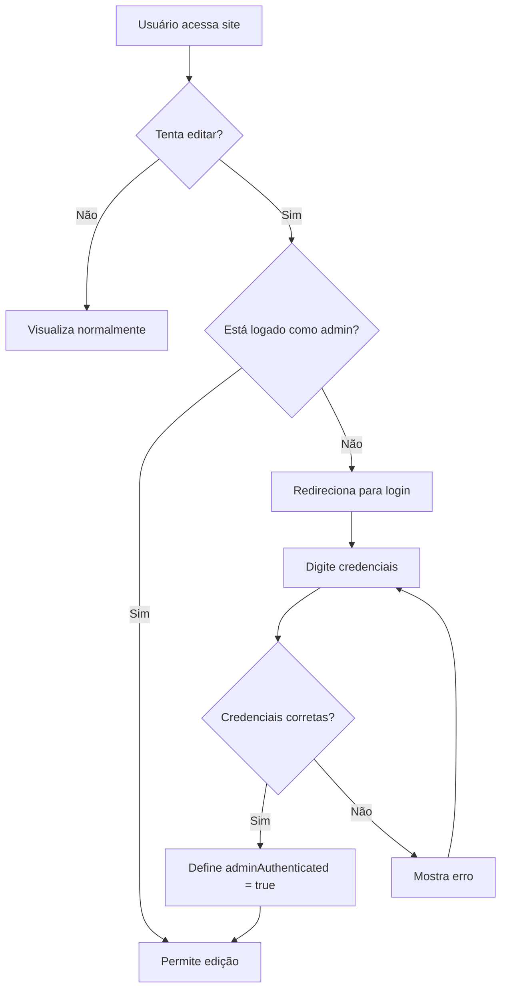

# 🔐 Sistema de Autenticação Admin - Fundação Escola Solidária

## 📋 Resumo

Sistema implementado para **proteger áreas administrativas** do site, permitindo que:
- **Usuários comuns**: Apenas visualizam dados
- **Administradores**: Podem editar e adicionar informações

---

## 🔑 Credenciais de Acesso

### **Login Admin:**
- **Usuário:** `admin`
- **Senha:** `escolasolidaria2024`

⚠️ **IMPORTANTE:** Altere a senha em produção no arquivo:
`/src/pages/admin-login.html` (linha 163)

---

## 📱 Páginas Protegidas

### 1. **Gestão Financeira** (`/src/pages/financeiro.html`)
- ✅ Usuários comuns: Visualizam totais e dados
- ✅ Admin: Pode adicionar/editar/excluir receitas e despesas

### 2. **Transparência** (`/src/pages/transp.html`)
- ✅ Usuários comuns: Visualizam informações e baixam relatórios
- ✅ Admin: Pode atualizar dados de transparência

---

## 🚀 Como Usar

### **1. Acessar como Visitante (Visualização)**
1. Entre no site normalmente
2. Navegue para "Gestão Financeira" ou "Transparência"
3. Visualize os dados (sem poder editar)

### **2. Acessar como Administrador**
1. Clique no botão **"Admin"** no menu (ícone de cadeado 🔒)
2. Digite as credenciais:
   - Usuário: `admin`
   - Senha: `escolasolidaria2024`
3. Clique em **"Entrar"**
4. Você será redirecionado com permissões de administrador

### **3. Editar Dados (Somente Admin)**
1. Após fazer login, acesse "Gestão Financeira"
2. Verá o banner: **"Modo Administrador"**
3. Clique em "Nova Receita" ou "Nova Despesa"
4. Edite clicando em qualquer célula da tabela
5. Os dados são salvos automaticamente

### **4. Sair do Modo Admin**
1. Clique no botão **"Sair"** no topo da página
2. Ou faça logout no menu

---

## 🛡️ Segurança Implementada

### **Proteções Ativas:**
✅ Autenticação via LocalStorage (sessão no navegador)  
✅ Verificação de permissão em todas as funções de edição  
✅ Botões de edição ocultos para não-admins  
✅ Mensagens informativas de "somente leitura"  
✅ Redirecionamento automático para login quando necessário  

### **Funcionamento:**
```javascript
// Sistema verifica se usuário é admin
isAdmin = localStorage.getItem('adminAuthenticated') === 'true';

// Se não for admin:
- Oculta botões de "Nova Receita/Despesa"
- Desabilita edição de células
- Mostra banner de "Modo Visualização"
- Redireciona para login ao tentar editar
```

---

## 📊 Recursos por Modo

| Funcionalidade | Visitante | Administrador |
|----------------|-----------|---------------|
| Visualizar dados | ✅ | ✅ |
| Baixar relatórios | ✅ | ✅ |
| Adicionar receitas/despesas | ❌ | ✅ |
| Editar valores | ❌ | ✅ |
| Excluir registros | ❌ | ✅ |
| Atualizar transparência | ❌ | ✅ |

---

## 🔧 Personalização

### **Alterar Senha:**
Edite o arquivo `/src/pages/admin-login.html`:
```javascript
const ADMIN_CREDENTIALS = {
    username: 'admin',
    password: 'NOVA_SENHA_AQUI'  // Altere aqui
};
```

### **Adicionar Múltiplos Usuários:**
Modifique a lógica de autenticação para usar um array:
```javascript
const ADMIN_USERS = [
    { username: 'admin1', password: 'senha1' },
    { username: 'admin2', password: 'senha2' }
];
```

### **Tempo de Sessão:**
Para adicionar expiração de sessão, adicione verificação de tempo:
```javascript
const loginTime = new Date(localStorage.getItem('adminLoginTime'));
const now = new Date();
const hoursPassed = (now - loginTime) / 1000 / 60 / 60;

if (hoursPassed > 24) { // Expira após 24 horas
    logout();
}
```

---

## 🎯 Fluxo de Autenticação



---

## 📝 Arquivos Modificados

1. **`/src/pages/admin-login.html`** - Nova página de login
2. **`/src/pages/financeiro.html`** - Proteção adicionada
3. **`/src/pages/transp.html`** - Proteção adicionada
4. **`/index.html`** - Link "Admin" adicionado ao menu

---

## ⚠️ Avisos Importantes

### **Produção:**
- ⚠️ **Altere a senha padrão imediatamente**
- ⚠️ Use HTTPS em produção
- ⚠️ Considere backend real com autenticação JWT
- ⚠️ LocalStorage não é 100% seguro para dados sensíveis

### **Melhorias Recomendadas:**
- Implementar backend com API REST
- Usar autenticação JWT (JSON Web Tokens)
- Adicionar criptografia de senhas (bcrypt)
- Implementar rate limiting (limite de tentativas)
- Adicionar autenticação de dois fatores (2FA)

---

## 🆘 Problemas Comuns

### **1. Não consigo fazer login**
- Verifique se digitou: `admin` / `escolasolidaria2024`
- Limpe o cache do navegador (Ctrl + Shift + Del)
- Tente em aba anônima

### **2. Login não persiste**
- Verifique se o navegador permite LocalStorage
- Desative extensões que bloqueiam cookies/storage
- Verifique configurações de privacidade

### **3. Ainda posso editar sem login**
- Limpe o LocalStorage: `localStorage.clear()`
- Recarregue a página (F5)
- Verifique o console do navegador (F12)

---

## 📞 Suporte

Para dúvidas ou problemas:
- Email: contato@escolasolidaria.org
- Desenvolvedor: [Seu contato aqui]

---

**Última atualização:** 7 de outubro de 2025
**Versão:** 1.0
